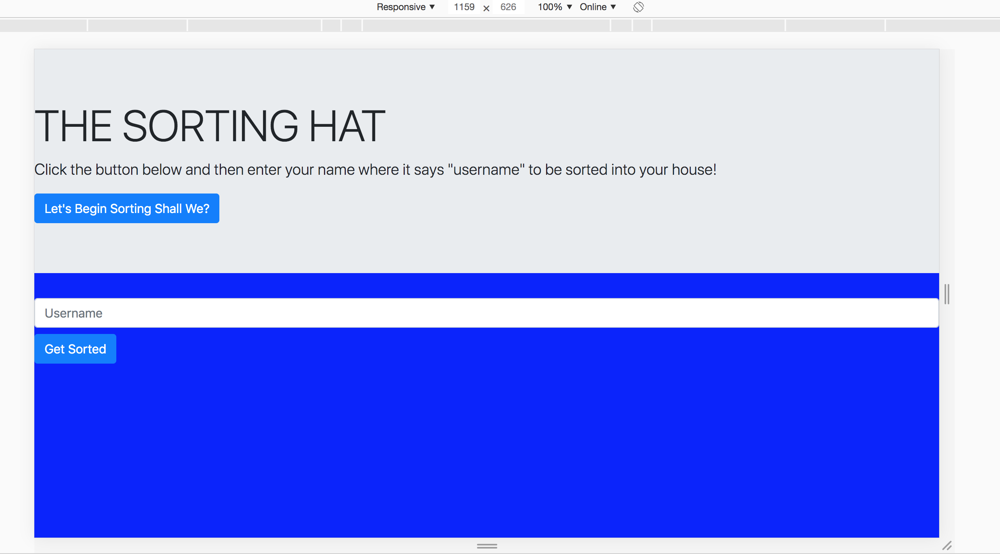

# Description
Sorting-Hat is a project exercise that uses bootstrap forms, print to DOM functions, and click events. It takes a name input and uses a sorting function to parse it into one of four random houses based on the world of Harry Potter.

# Getting Started

1. Clone down repo

2. Launch project using your preferred serve (I use http: https://www.npmjs.com/package/http-server)

3. Choose a browser (such as https://www.google.com/chrome/) 

4. Using your browser, go to address where project will be served (such as localhost:8080)

# Contributors 
* [Mark A. Young](https://github.com/MarkyAaronYoung)

# Feature Request/TODO
- [x] A [bootstrap jumpbotron](https://getbootstrap.com/docs/4.0/components/jumbotron/) to introduces the sorting hat
- [x] A [bootstrap form](https://getbootstrap.com/docs/4.1/components/forms/) is employed for "students" to fill in their names
- [x] Submitting form sorts student names into one of four houses at random (Gryffindor, Hufflepuff, Ravenclaw, or Slytherin) and returns name and random house on a [bootstrap](https://getbootstrap.com/docs/4.1/components/card/)
- [ ] An expel button on the card should hide/remove the student card 

# Screenshots


# Code Block Example
```
// function that creates a card by looping over the new student array created by the addStudent function
const buildStudentCards = (studentArray) => {
  let domString = ''; 
  for (let i = 0; i < studentArray.length; i++){
    domString += `
      <div class="card" style="width: 18rem;">
        <div class="card-body">
          <h5 class="card-title">${studentArray[i]}</h5>
          <p class="card-text">${sortedHouse()}</p>
          <a href="#" class="btn btn-primary">Expel</a>
        </div>
      </div>
    `;
  };
  console.log('do I work?')
  printToDom('#studentCard', domString);
}
